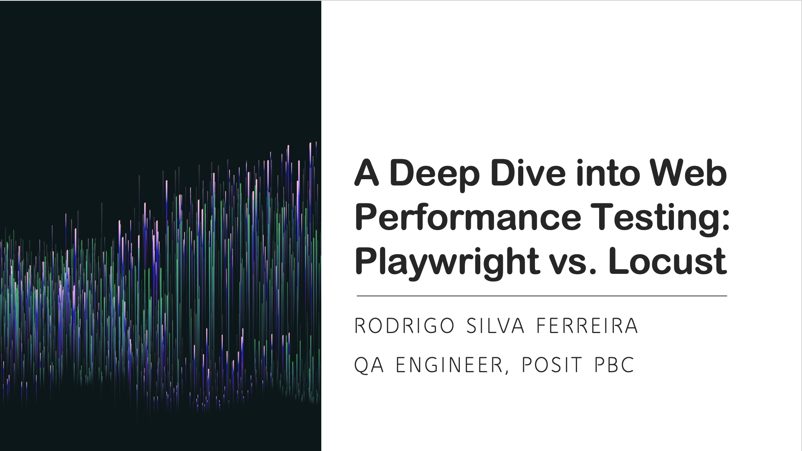

# A Deep Dive into Web Performance Testing: Playwright vs. Locust

Welcome to this brains-on workshop exploring two powerful tools for web performance testing: **Playwright** and **Locust**. Through guided exercises, participants will simulate user interactions and load scenarios to evaluate the performance of real websites.



---

## Workshop Objectives

By the end of this session, you will:
- Understand the differences between browser automation and load testing.
- Use **Playwright** to measure page load times under various conditions.
- Use **Locust** to simulate user load and test server-side performance.
- Compare navigation methods and the impact of caching on page performance.
- Visualize and interpret performance results using Python and plotting libraries.

---

## Project Structure

```
.
├── q1a-bts-pw.json           # Playwright Results - Click navigation, no caching
├── q1b-bts-pw.json           # Playwright Results - Direct link navigation, no caching
├── q2a-bts-pw.json           # Playwright Results - Click navigation, with caching
├── q2b-bts-pw.json           # Playwright Results - Direct link navigation, with caching (this and files above are generated after running corresponding scripts)
├── urls.txt                  # Category names and URLs for BooksToScrape
├── q1a-bts-pw.py             # Playwright Script for Q1(a)
├── q1b-bts-pw.py             # Playwright Script for Q1(b)
├── q2a-bts-pw.py             # Playwright Script for Q2(a)
├── q2b-bts-pw.py             # Playwright Script for Q2(b)
├── plots-q1q2.py             # Generation of plots (optional, since qmd file already does that)
├── books-performance.qmd     # Quarto notebook for analysis & visualizations
├── q3-bts-eda.py             # Exploratory Data Analysis
├── q4-bts-loc.py             # Loacust load test script for BooksToScrape website
├── q5-pycon-pw              # Playwright test for measuring load times of PyCon Colombia websites (DO NOT RUN)
├── LICENSE                  # MIT License (NO liability, AS-IS)
└── README                   # Notes and instructions             
```

---

## Requirements

### 💡 Tip: Install [VS Code](https://code.visualstudio.com/) (for running Playwright and Locust scripts) and [Positron](https://positron.posit.co/download.html) (for data analysis).

### 1. Create and activate your virtual environment
```bash
python -m venv venv
source venv/bin/activate
```

### 2. Install Python packages

Install all required dependencies using:

```bash
pip install -r requirements.txt
```

Your `requirements.txt` should contain:

```
locust
matplotlib
pandas
playwright
seaborn
```

### 3. Install Playwright browser binaries

After installing the Playwright package, you must install the browser binaries:

```bash
playwright install
```

This will set up Chromium, Firefox, and WebKit so Playwright can automate them during tests.

---

## Exercises

### Question 1: Navigation Method
**How does the method of navigation (clicking vs. direct links) impact loading times?**

Scripts:
- `q1a-bts-pw.py`
- `q1b-bts-pw.py`


### Question 2: Caching Effects
**How does caching affect loading times, with each navigation method?**

Scripts:
- `q2a-bts-pw.py`
- `q2b-bts-pw.py`

### Question 3: Number of Books and Loading Times
**Does the number of books in a category affect loading times?**

After running Q1 and Q2 scripts:
- `q3-bts-eda.py`

### Question 4: Load Testing
Use Locust to simulate X users accessing the site:
```bash
locust -f q4-bts-loc.py --host https://books.toscrape.com -u 25 -r 5 --run-time 30s
```

### Question 5: PyCon Website Load Times (do NOT run!)
Compare how PyCon sites from different years perform:
- `q5-pycon-pw.py`

---

## Analysis & Visualization

Use the provided `books-performance.qmd` Quarto notebook to:

- Analyze load time distributions
- Run t-tests to assess significance
- Visualize relationships between book count and load time
- Identify slowest categories

---

## Author

[Rodrigo Silva Ferreira](https://www.linkedin.com/in/rsf309/)
---

## Feedback & Contributions

Have ideas or suggestions? Please feel free to email me at rodrigosf672@gmail.com or to open an issue (even if it's just a question!)

---

## License

This project is licensed under the [MIT License](LICENSE).
